# Pattern — Progetti DH attivi vs discontinuati

_Letture trasversali di `report-progetti-vivi.md` (n=14) e `report-progetti-morti.md` (n=12). Campioni piccoli: le percentuali sono indicative e non hanno valore inferenziale._

---

## Pattern 1 — Le pratiche di sostenibilità separano i due gruppi

I progetti vivi superano i morti su **tutti e quattro** gli item di sostenibilità (Likert 1–5). Il divario più ampio, di gran lunga, è sulla **documentazione tecnica (C3)**: +1.49 punti — mediana 4.5 contro 2.5, moda 5 contro 3. La pianificazione iniziale (C1) è l'item più debole per entrambi, ma nei morti scende sotto la soglia critica (2.67).

```mermaid
%%{init: {'themeVariables': {'xyChart': {'plotColorPalette': '#2e7d32, #c62828'}}}}%%
xychart-beta
    title "Sostenibilità C1-C4 — media Likert (verde = vivi, rosso = morti)"
    x-axis ["C1 piano iniziale", "C2 discussione fine fondi", "C3 documentazione", "C4 FAIR"]
    y-axis "Media (1-5)" 0 --> 5
    bar [3.14, 3.50, 4.07, 3.29]
    bar [2.67, 3.08, 2.58, 2.75]
```



| Item | Vivi | Morti | Δ |
|---|---|---|---|
| C1 — piano di sostenibilità iniziale | 3.14 | 2.67 | +0.47 |
| C2 — discussione fine finanziamento | 3.50 | 3.08 | +0.42 |
| **C3 — documentazione tecnica** | **4.07** | **2.58** | **+1.49** |
| C4 — accessibilità a lungo termine (FAIR) | 3.29 | 2.75 | +0.54 |

---

## Pattern 2 — Percezione vs realtà: i vivi temono la tecnologia, i morti sono morti a cause dei soldi

Le cause che i progetti attivi **si aspettano** (D3) sono quasi l'inverso di quelle che i progetti discontinuati **riportano davvero** (D1). I vivi mettono in cima l'obsolescenza tecnologica (64%); tra i morti la prima causa reale è la **fine del finanziamento senza piano di continuazione (75%)**, seguita dalla mancanza di supporto istituzionale (50%).

```mermaid
%%{init: {'themeVariables': {'xyChart': {'plotColorPalette': '#1565c0, #c62828'}}}}%%
xychart-beta
    title "Cause attese dai vivi (blu, D3) vs cause reali dei morti (rosso, D1) — %"
    x-axis ["Fine finanziamento", "Supporto istituzionale", "Obsolescenza tecn.", "Orphaning", "Guasto server", "Chiusura deliberata"]
    y-axis "% dei progetti" 0 --> 80
    bar [43, 36, 64, 57, 21, 14]
    bar [75, 50, 25, 25, 8, 8]
```



| Causa | Attesa (vivi, D3) | Reale (morti, D1) |
|---|---|---|
| Fine del finanziamento senza piano | 43% | **75%** |
| Ristrutturazione / mancanza supporto istituzionale | 36% | **50%** |
| Obsolescenza tecnologica | **64%** | 25% |
| Orphaning (abbandono personale chiave) | **57%** | 25% |
| Guasto server / scadenza hosting | 21% | 8% |
| Decisione deliberata di chiudere | 14% | 8% |

---

## Pattern 3 — I fattori di morte sono socio-economici, non tecnici

Il ranking dei fattori di rischio valutati dai progetti morti (D2, gravità percepita 1–5) conferma il pattern 2: i tre fattori in testa sono istituzionali ed economici, tutti i fattori tecnici stanno nella metà bassa.

```text
Mancanza di supporto istituzionale      3.83  ███████████████▍
Finanziamento insufficiente/temporaneo  3.75  ███████████████
Assenza di pianificazione sostenibilità 3.58  ██████████████▎
Perdita di personale chiave             3.00  ████████████
Assenza figura di manutenzione          2.91  ███████████▋
Dispute su diritti/proprietà            2.36  █████████▍
Obsolescenza tecnologica (bit rot)      2.30  █████████▏
Guasto server/hosting                   2.09  ████████▍
Documentazione insufficiente            2.00  ████████
Problemi legali/normativi               2.00  ████████
Dipendenza da tecnologie deprecate      1.92  ███████▋
Mancato rinnovo dominio/hosting         1.83  ███████▎
Scarsa interoperabilità                 1.82  ███████▎
```

I tre fattori più temuti in astratto dai vivi (obsolescenza, orphaning) compaiono qui rispettivamente al 7° e 4° posto: chi il fallimento lo ha vissuto colloca il rischio altrove.

---

## Pattern 4 — L'hosting istituzionale non protegge; una figura di manutenzione sì

L'**83% dei progetti morti girava su infrastruttura istituzionale**, contro un panorama molto più diversificato tra i vivi. Letto insieme al primo fattore di rischio del pattern 3 (mancanza di supporto istituzionale), il dato suggerisce che l'infrastruttura "interna" senza un impegno formale dell'ente non è una garanzia — è il contesto in cui la maggior parte dei progetti è morta.

```text
Hosting (B5)
  Morti  istituzionale  83%  ████████████████████▊
         esterno        17%  ████▎
  Vivi   istituzionale  43%  ██████████▊
         esterno        43%  ██████████▊
         misto          14%  ███▌

Figura responsabile della manutenzione (C5 = Sì)
  Vivi   57%  ██████████████▎
  Morti  33%  ████████▎
```

La presenza di una figura responsabile della manutenzione a lungo termine è invece nettamente più frequente tra i vivi (57% vs 33%): insieme alla documentazione (pattern 1), è il tratto operativo che più distingue i sopravvissuti.

---

## Pattern 5 — Problemi sistemici condivisi

Tre condizioni accomunano i due gruppi e indicano fragilità strutturali del settore, indipendenti dall'esito:

```text
Il finanziatore NON ha richiesto un piano di sostenibilità (C6)
  Morti  83%  ████████████████████▊
  Vivi   71%  █████████████████▊   (il restante 29% "non lo so" — nessun "sì")
```

1. **Nessun obbligo di sostenibilità dai finanziatori.** Tra i vivi nessun rispondente dichiara che il finanziatore abbia richiesto un piano; tra i morti solo il 17%.
2. **Segnali premonitori non riconosciuti.** L'83% dei morti dichiara che non c'erano segnali (D4) — ma i segnali indicati da chi li ha visti (personale in uscita 25%, finanziamento in scadenza 17%) coincidono esattamente con le cause reali di morte. Tra i vivi il 29% riconosce già segnali analoghi.
3. **Anche i vivi si sentono a rischio.** La probabilità percepita di future problematiche di mantenimento è media **3.50/5 con moda 5** (D2 vivi), e il 21% ha già subito episodi di inaccessibilità (attacchi informatici, limiti di spazio, server istituzionali indisponibili, personale precario).

---

## Sintesi

1. La sopravvivenza non dipende dal tipo di progetto (output, team e istituzioni sono simili) ma dalle **pratiche**: documentazione, figura di manutenzione, pianificazione.
2. Esiste un **disallineamento sistematico nella percezione del rischio**: i vivi temono la tecnologia, i morti sono morti di finanziamenti e istituzioni.
3. L'**hosting istituzionale senza impegno formale** è il contesto tipico della discontinuazione, non una protezione.
4. L'assenza di requisiti di sostenibilità nei bandi è il **fattore sistemico** trasversale su cui intervenire.
