# Pattern — Progetti DH attivi vs discontinuati

_Letture trasversali di `report-progetti-vivi.md` (n=14) e `report-progetti-morti.md` (n=12). Campioni piccoli: le percentuali sono indicative e non hanno valore inferenziale._

_Le testimonianze in citazione provengono da **risposte via email** dei responsabili dei progetti, raccolte come follow-up del questionario e del controllo di liveness. Sono **anonimizzate** (rimossi nomi, URL e riferimenti identificativi univoci; conservati i concetti e le categorie generali — tipo di ente, tipo di finanziamento, meccanismo) e integrate nei pattern come evidenza qualitativa._

---

## Pattern 1 — Le pratiche di sostenibilità separano i due gruppi

I progetti vivi superano i morti su **tutti e quattro** gli item di sostenibilità (Likert 1–5). Il divario più ampio, di gran lunga, è sulla **documentazione tecnica (C3)**: +1.49 punti — mediana 4.5 contro 2.5, moda 5 contro 3. La pianificazione iniziale (C1) è l'item più debole per entrambi, ma nei morti scende sotto la soglia critica (2.67).

```mermaid
%%{init: {'themeVariables': {'xyChart': {'plotColorPalette': '#2e7d32, #c62828'}}}}%%
xychart-beta
    title "Sostenibilità C1-C4 — media Likert (verde = vivi, rosso = morti)"
    x-axis ["C1 piano iniziale", "C2 discussione fine fondi", "C3 documentazione", "C4 FAIR"]
    y-axis "Media (1-5)" 0 --> 5
    bar [3.14, 3.50, 4.07, 3.29]
    bar [2.67, 3.08, 2.58, 2.75]
```



| Item | Vivi | Morti | Δ |
|---|---|---|---|
| C1 — piano di sostenibilità iniziale | 3.14 | 2.67 | +0.47 |
| C2 — discussione fine finanziamento | 3.50 | 3.08 | +0.42 |
| **C3 — documentazione tecnica** | **4.07** | **2.58** | **+1.49** |
| C4 — accessibilità a lungo termine (FAIR) | 3.29 | 2.75 | +0.54 |

---

## Pattern 2 — Percezione vs realtà: i vivi temono la tecnologia, i morti sono morti a cause dei soldi

Le cause che i progetti attivi **si aspettano** (D3) sono quasi l'inverso di quelle che i progetti discontinuati **riportano davvero** (D1). I vivi mettono in cima l'obsolescenza tecnologica (64%); tra i morti la prima causa reale è la **fine del finanziamento senza piano di continuazione (75%)**, seguita dalla mancanza di supporto istituzionale (50%).

```mermaid
%%{init: {'themeVariables': {'xyChart': {'plotColorPalette': '#1565c0, #c62828'}}}}%%
xychart-beta
    title "Cause attese dai vivi (blu, D3) vs cause reali dei morti (rosso, D1) — %"
    x-axis ["Fine finanziamento", "Supporto istituzionale", "Obsolescenza tecn.", "Orphaning", "Guasto server", "Chiusura deliberata"]
    y-axis "% dei progetti" 0 --> 80
    bar [43, 36, 64, 57, 21, 14]
    bar [75, 50, 25, 25, 8, 8]
```



| Causa | Attesa (vivi, D3) | Reale (morti, D1) |
|---|---|---|
| Fine del finanziamento senza piano | 43% | **75%** |
| Ristrutturazione / mancanza supporto istituzionale | 36% | **50%** |
| Obsolescenza tecnologica | **64%** | 25% |
| Orphaning (abbandono personale chiave) | **57%** | 25% |
| Guasto server / scadenza hosting | 21% | 8% |
| Decisione deliberata di chiudere | 14% | 8% |

> _«Non era un sito statico ma un'applicazione web complessa per l'epoca — grafi interattivi, mappe, più componenti collegati, in versioni successive. Dopo l'ultimo passaggio di proprietà dell'azienda e di questo asset il sito è stato chiuso: non me la sono sentita di prenderlo in carico a titolo gratuito, sarebbe stato più semplice rifarlo da capo. Ho ancora gran parte dei dati.»_ — responsabile di un progetto ospitato da un'azienda privata _(testimonianza anonimizzata)_

A conferma del pattern: anche dove la tecnologia era complessa, l'innesco non è il degrado tecnico in sé ma un **passaggio di proprietà societario** seguito dall'assenza di qualcuno disposto a farsi carico della manutenzione. La complessità tecnica è un aggravante, non la causa.

---

## Pattern 3 — I fattori di morte sono socio-economici, non tecnici

Il ranking dei fattori di rischio valutati dai progetti morti (D2, gravità percepita 1–5) conferma il pattern 2: i tre fattori in testa sono istituzionali ed economici, tutti i fattori tecnici stanno nella metà bassa.

```text
Mancanza di supporto istituzionale      3.83  ███████████████▍
Finanziamento insufficiente/temporaneo  3.75  ███████████████
Assenza di pianificazione sostenibilità 3.58  ██████████████▎
Perdita di personale chiave             3.00  ████████████
Assenza figura di manutenzione          2.91  ███████████▋
Dispute su diritti/proprietà            2.36  █████████▍
Obsolescenza tecnologica (bit rot)      2.30  █████████▏
Guasto server/hosting                   2.09  ████████▍
Documentazione insufficiente            2.00  ████████
Problemi legali/normativi               2.00  ████████
Dipendenza da tecnologie deprecate      1.92  ███████▋
Mancato rinnovo dominio/hosting         1.83  ███████▎
Scarsa interoperabilità                 1.82  ███████▎
```

I tre fattori più temuti in astratto dai vivi (obsolescenza, orphaning) compaiono qui rispettivamente al 7° e 4° posto: chi il fallimento lo ha vissuto colloca il rischio altrove.

> _«I referenti strutturati — un professore ordinario e uno associato di informatica, un ricercatore senior — sono andati in pensione nei cinque anni dopo la pubblicazione. È così mancato un referente interno capace di sostenere la richiesta di un minimo finanziamento per aggiornare il sistema. La macchina è stata spenta; non essendo io in quell'ateneo, non sono stato nemmeno informato in anticipo, e una mia richiesta formale al rettorato non ha mai ricevuto risposta.»_ — responsabile di un progetto in ambito accademico _(testimonianza anonimizzata)_

Questa risposta riassume da sola i primi fattori del grafico: **pensionamento del personale chiave → perdita del referente interno → niente fondi per l'aggiornamento → spegnimento**. Il progetto era sostenuto da fondi di ateneo, da un fondo di ricerca nazionale estero e da finanziamenti internazionali, e riguardava materiali di rilevante valore patrimoniale: prestigio e qualità non hanno impedito la discontinuazione. Un altro responsabile segnala di **non gestire direttamente il sito e di non essere stato a conoscenza del malfunzionamento** — qui era esternalizzata la stessa sorveglianza sullo stato del servizio.

---

## Pattern 4 — L'hosting istituzionale non protegge; una figura di manutenzione sì

L'**83% dei progetti morti girava su infrastruttura istituzionale**, contro un panorama molto più diversificato tra i vivi. Letto insieme al primo fattore di rischio del pattern 3 (mancanza di supporto istituzionale), il dato suggerisce che l'infrastruttura "interna" senza un impegno formale dell'ente non è una garanzia — è il contesto in cui la maggior parte dei progetti è morta.

```text
Hosting (B5)
  Morti  istituzionale  83%  ████████████████████▊
         esterno        17%  ████▎
  Vivi   istituzionale  43%  ██████████▊
         esterno        43%  ██████████▊
         misto          14%  ███▌

Figura responsabile della manutenzione (C5 = Sì)
  Vivi   57%  ██████████████▎
  Morti  33%  ████████▎
```

La presenza di una figura responsabile della manutenzione a lungo termine è invece nettamente più frequente tra i vivi (57% vs 33%): insieme alla documentazione (pattern 1), è il tratto operativo che più distingue i sopravvissuti. Le testimonianze dei progetti vivi mostrano *cosa*, in concreto, tiene acceso un sito:

> _«Il centro interuniversitario rinnova ogni anno il pagamento dell'hosting per garantire la visibilità del sito e dei materiali.»_ — progetto attivo dal 2012 _(testimonianza anonimizzata)_

> _«Siamo un'associazione che si autofinanzia: per digitalizzare dobbiamo trovare di volta in volta i progetti. Il sito ha problemi legati all'obsolescenza, ma con i nostri pochi mezzi cerchiamo di tenerlo il più stabile possibile; senza una struttura informatica solida alle spalle ha molte criticità.»_ — archivio gestito da un'associazione _(testimonianza anonimizzata)_

Il primo caso è sopravvivenza per **impegno ricorrente esplicito** (qualcuno, di proposito, paga ogni anno); il secondo è la sua immagine speculare — sopravvivenza precaria affidata a mezzi scarsi e senza struttura tecnica, cioè esattamente la condizione che nei morti ha portato allo spegnimento.

---

## Pattern 5 — Problemi sistemici condivisi

Tre condizioni accomunano i due gruppi e indicano fragilità strutturali del settore, indipendenti dall'esito:

```text
Il finanziatore NON ha richiesto un piano di sostenibilità (C6)
  Morti  83%  ████████████████████▊
  Vivi   71%  █████████████████▊   (il restante 29% "non lo so" — nessun "sì")
```

1. **Nessun obbligo di sostenibilità dai finanziatori.** Tra i vivi nessun rispondente dichiara che il finanziatore abbia richiesto un piano; tra i morti solo il 17%.
2. **Segnali premonitori non riconosciuti.** L'83% dei morti dichiara che non c'erano segnali (D4) — ma i segnali indicati da chi li ha visti (personale in uscita 25%, finanziamento in scadenza 17%) coincidono esattamente con le cause reali di morte. Tra i vivi il 29% riconosce già segnali analoghi.
3. **Anche i vivi si sentono a rischio.** La probabilità percepita di future problematiche di mantenimento è media **3.50/5 con moda 5** (D2 vivi), e il 21% ha già subito episodi di inaccessibilità (attacchi informatici, limiti di spazio, server istituzionali indisponibili, personale precario).

Una testimonianza mette in discussione anche **come misuriamo il finanziamento**:

> _«La domanda sul finanziamento ammette una sola risposta, ma i progetti vanno avanti con più tipi di finanziamento nel tempo: nel mio caso prima un finanziamento regionale, poi i contributi di una fondazione, poi fondi personali di ricerca.»_ _(testimonianza anonimizzata)_

Il modello a scelta singola **sottostima la natura "a mosaico" e sequenziale** dei finanziamenti reali — un avvertimento da tenere presente leggendo B2. Un altro rispondente ha potuto condividere solo in parte le informazioni per un **vincolo di riservatezza (NDA)**: anche l'opacità contrattuale limita la trasparenza sul ciclo di vita.

---

## Pattern 6 — La «morte apparente»: spesso muore l'URL, non il progetto

Il dato più importante che emerge dalle risposte qualitative non è nei numeri: **molti progetti classificati come discontinuati sono, in qualche forma, ancora vivi.** La «morte» rilevata a livello di URL pubblico **sovrastima** la morte effettiva del progetto e dei suoi dati.

```text
Stato reale dei 12 progetti «discontinuati» (dalle risposte via email)
  Confluito in un nuovo progetto finanziato   ██████           2   (un nuovo PRIN + infrastruttura CNR; un progetto ampliato dopo il grant europeo)
  Ancora online a un altro indirizzo          ███              1   (sito spostato, nessun reindirizzamento)
  Servizio spento ma codice/dati conservati   ██████           2   (codice su repository pubblico; dati ancora in possesso del responsabile)
  Spento, esito dei dati non noto             ██████           2   (reindirizzamento decaduto; macchina spenta dall'ente)
  Nessun dettaglio sullo stato / NDA          ███████████████  5
```

Almeno **5 dei 12** progetti per cui è arrivata una risposta mostrano sopravvivenza di servizio, dati o codice, oppure migrazione in nuove iniziative; solo 2 risultano spenti con esito dei dati incerto. Due testimonianze sono esplicite:

> _«Il progetto non ha mai smesso di essere implementato; senza i fondi europei è stato un lavoro un po' "sotterraneo", e a breve confluirà in un nuovo progetto ampliato. I problemi che segnalate sono reali — ci siamo salvati per il rotto della cuffia: è la non-sostenibilità di un sistema basato su progetti a termine, incapace di mantenere servizi e strumenti nel lungo periodo.»_ _(testimonianza anonimizzata)_

> _«Il progetto prosegue, con più o meno finanziamenti, dentro un nuovo PRIN e un'infrastruttura di ricerca nazionale.»_ _(testimonianza anonimizzata)_

**Implicazione metodologica:** il controllo di liveness su URL (cfr. `archivechecker3.py`) cattura la disponibilità del *servizio pubblico*, non la sopravvivenza del *progetto*. Una quota dei «morti» è in realtà **migrata, rinominata, o ridotta a dati e codice conservati** — uno stato intermedio che meriterebbe una codifica a sé nel dataset, distinta dal binario vivo/morto.

---

## Sintesi

1. La sopravvivenza non dipende dal tipo di progetto (output, team e istituzioni sono simili) ma dalle **pratiche**: documentazione, figura di manutenzione, pianificazione.
2. Esiste un **disallineamento sistematico nella percezione del rischio**: i vivi temono la tecnologia, i morti sono morti di finanziamenti e istituzioni — e la testimonianza-chiave (pensionamenti → perdita del referente interno → spegnimento) lo illustra meglio di qualsiasi media.
3. L'**hosting istituzionale senza impegno formale** è il contesto tipico della discontinuazione; ciò che salva è un impegno ricorrente esplicito (chi rinnova l'hosting ogni anno) e una figura di manutenzione.
4. L'assenza di requisiti di sostenibilità nei bandi è il **fattore sistemico** trasversale; va letta insieme alla natura sequenziale e "a mosaico" dei finanziamenti reali, che il questionario a scelta singola sottostima.
5. La **morte è spesso apparente**: a livello di URL il servizio è giù, ma dati, codice o l'intero progetto sopravvivono, spesso migrando in nuovi finanziamenti. Misurare la discontinuazione sul solo URL la sovrastima.
